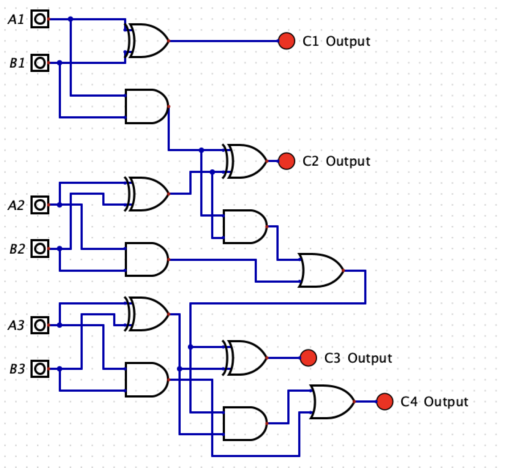
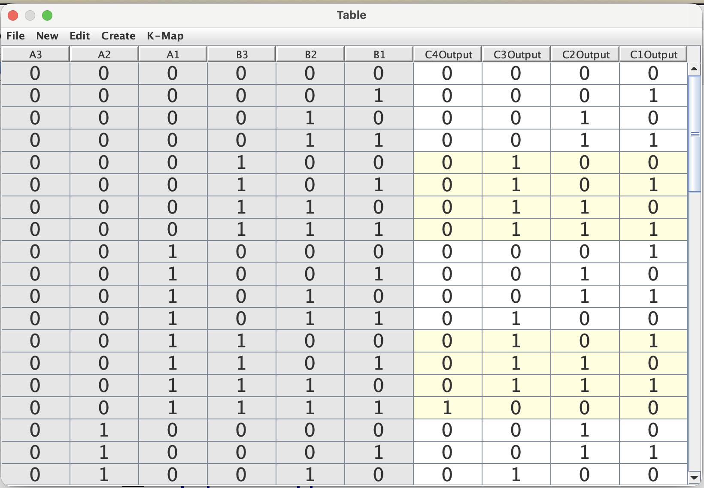

# April 26: Started learning the concepts of logic gates and laws

I had started this project before applying to Forge, hence the actual date I had started this project was April 26, 2026. Before starting to work on this project, I felt it was essential to grasp the fundamentals of hardware. Thus, I learnt about what logic gates are and how they function. I also explored the concept of logic laws such as commutative, distributive, associative, and De Morgan laws.

**Total time spent: 1.5 hours**

# April 29: Started learning the concept of boolean functions and algebra

Building on my knowledge that had aqcuired about logic gates and laws, I decided to explore the concept of boolean functions further by learning about how any function could be represented using NAND operations. Furthermore, I also expanded my learning about boolean algebra and how to compare and simplify an expression in its Disjunctive Normal Form 'DNF'.

**Total time spent: 1.5 hours**

# April 30: Learning about composite gates and black box diagrams + 

To conclude my fundamental conceptual learning, I discovered black box diagrams and briefly explored composite gates. I found that black box diagrams are often used in the hardware industry to showcase how a chip handles an input and output along with the aspects which are visible to the user. Therefore, I also learnt the difference between interface and implementation.

After my fundamentals were completed to my satisfactory, I tried to gain some hands-on experience by constructing an 3-bit ripple adder using Logism and seeing how the truth table forms. The adder works by collecting six inputs to provide four outputs. The circuit utilises a sequential daisy-chain configuration to ripple carry signals between bits.

At the beginning of the chain, the least significant bits 'A1' and 'B1' are processed by a half adder to determine the first sum bit, 'C1'. This calculation simultaneously generates a carry signal. This carry signal is then daisy-chained directly forward into the next section of the circuit. Here, a full adder combines bits 'A2' and 'B2' with that incoming carry link. This step produces the second sum bit, 'C2', and creates a brand-new carry signal. This new carry signal is then daisy-chained into the final full adder block. This final block processes the most significant bits, 'A3' and 'B3'. It outputs the final sum bit, 'C3', along with the ultimate carry-out bit, 'C4'. Thus, each subsequent addition relies on the carry information passed from the previous bits.

**Total time spent: 2.5 hours**
